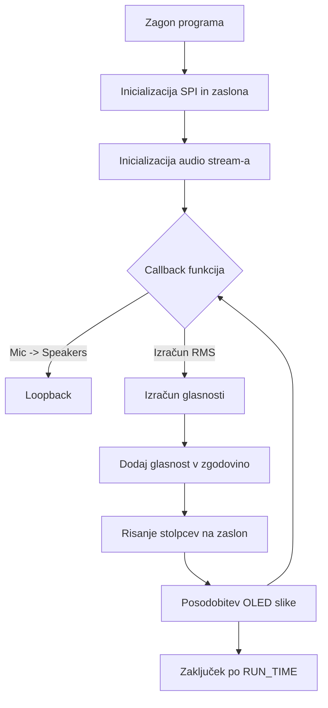

# Seminarsko poročilo

**Naslov:** Audio Visualizer z OLED C Click na Raspberry Pi

**Avtor:** Žiga Fon

**Datum:** 1.10.2025

---

## Povzetek

V tem seminarskem poročilu predstavim izvedbo realnočasovnega avdio vizualizerja na platformi Raspberry Pi 3B, ki uporablja OLED C Click (PSP27801; 96×96 px) z SSD1351 gonilnikom in USB mikrofonom (Rode NT USB). Sistem zajema avdio signal, ga predvaja skozi zvočnike (loopback) in na zaslon v realnem času prikazuje stolpični vizualizator glasnosti. Namen projekta je prikaz interakcije med strojno opremo (SPI, GPIO) in programsko opremo. Python, knjižnicami za zvočno obdelavo (sounddevice) in risanje na OLED (**adafruit-circuitpython-ssd1351** in **Pillow**).

## Vsebina

1. Uvod
2. Cilji projekta
3. Komponente in tehnične specifikacije
4. Napeljava (Wiring)
5. Namestitev programske opreme
6. Programska rešitev (koda in pojasnilo)
7. Rezultati in opazovanja
8. Omejitve in možne izboljšave
9. Viri in dokumentacija (povezave)

---

## 1. Uvod

Audio vizualizator je praktičen primer za učenje zajema podatkov iz zunanjih senzorjev (mikrofon), realnočasovnega procesiranja signalov in grafičnega izhoda na majhne barvne zaslone. Projekt je zasnovan tako, da deluje na "headless" Raspberry Pi OS Lite, kar pomeni, da ni potrebna grafična namestitev X Window ali drugih težkih paketov; vse je narejeno v Pythonu z uporabo knjižnic, ki neposredno komunicirajo s priključenim zaslonom preko SPI.

## 2. Cilji projekta

- Uporabiti OLED C Click (PSP27801, 96×96) kot prikazovalnik.
- Zajeti avdio iz USB mikrofona in v realnem času izračunati glasnost (RMS).
- Prikazati zadnjih N intervalov glasnosti kot barvne stolpce na zaslonu.
- Predvajati zvok (loopback) na priključene zvočnike.

## 3. Komponente in tehnične specifikacije

- **OLED C Click (MIKROE-1585)**

  - Panel: PSP27801, 1.12" kvadratni OLED.
  - Resolucija: 96 × 96 slikovnih pik; uporablja SSD1351 kot grafični gonilnik.
  - Napetost: 3.3 V napajanje za VCC in logiko.

- **Raspberry Pi 3B**

  - Sistem: Raspberry Pi OS Lite (32-bit)
  - SPI vmesnik (uporabljen za komunikacijo z zaslonom)

- **Mikrofon:** Rode NT USB (USB kondenzatorski mikrofon)

- **Zvočniki:** analogni zvočniki, priključeni na Raspberry Pi

- **Glavne programske knjižnice:**

  - `python3`, `numpy`, `Pillow` (PIL) — za grafiko
  - `sounddevice` — za zajem in predvajanje zvoka preko PortAudio
  - `adafruit-circuitpython-ssd1351` — za upravljanje zaslona SSD1351 preko SPI

## 4. Napeljava (Wiring)

Priključitev OLED C Click na Raspberry Pi preko SPI:

- **SPI Pins:**

  - **SCK (Clock)** → Raspberry Pi SCK (GPIO 11; fizični pin 23). Ta pin pošilja takte, ki usklajujejo prenos podatkov preko SPI.
  - **MOSI (Master Out Slave In)** → Raspberry Pi MOSI (GPIO 10; fizični pin 19). Po tem pinu Raspberry Pi pošilja podatke v zaslon.

- **Nadzorni pini:**

  - **CS (Chip Select)** → GPIO 17 (fizični pin 11). Aktivira oziroma izbere napravo, s katero trenutno komunicira SPI master (Raspberry Pi). Ko je CS v logičnem stanju LOW, zaslon prejema podatke.
  - **DC (Data/Command)** → GPIO 25 (fizični pin 22). Določa, ali se pošilja ukaz (Command) ali podatki (Data). Pri LOW je to ukaz, pri HIGH pa podatki za risanje.
  - **RST (Reset)** → GPIO 24 (fizični pin 18). Ob inicializaciji zaslona pošiljanje kratkega impulza na RESET pin ponastavi SSD1351 gonilnik.

- **Napajanje in zemlja:**

  - **VCC** → 3.3V. Napajanje celotnega OLED modula.
  - **GND** → GND. Skupna masa.
  - **ENABLE → 3.3V (GND pomeni izklop). Omogoča ali onemogoča napajanje vezja OLED.**

> POZOR: Raspberry privzeto uporablja GPIO 7 ali 8 za Chip select a ssd1351.SSD1351 ne sprejema teh pinov, zato mora biti uporabljen eden od običajnih digitalnih GPIO.

## 5. Namestitev programske opreme

### Posodobitev sistema

```sh
sudo apt update
sudo apt upgrade -y
```

### Namestitev paketov

```sh
sudo apt install python3-pip python3-pil python3-numpy python3-smbus git -y
pip3 install adafruit-circuitpython-ssd1351 sounddevice
```

### Kloniranje repozitorija

```sh
git clone https://github.com/yourusername/audio-visualizer-oled.git
cd audio-visualizer-oled
```

### Zagon programa

```sh
python3 audio-visualizer.py
```

## 6. Programska rešitev (koda in pojasnilo)

Vključena je Python skripta, ki:

1. Inicializira SPI in SSD1351 zaslon preko `adafruit_rgb_display.ssd1351`.
2. Uporabi `sounddevice.Stream` z callback funkcijo za realnočasovno obdelavo in loopback.
3. Izračuna glasnost bloka z RMS ali normirano L2 normo in jo preslika v višino stolpca.
4. Na zaslon riše stolpce (barvne pravokotnike) iz zgodovine vrednosti.

### Celotna koda:

```python
# (koda je priložena) - spodaj je izsek iz projekta
import time, random
import numpy as np
import sounddevice as sd
import board, busio, digitalio
from PIL import Image, ImageDraw
import adafruit_rgb_display.ssd1351 as ssd1351

# --------- Config ---------
WIDTH, HEIGHT = 128, 128   # Full SSD1351 resolution
BAR_WIDTH     = 4          # pixel width of each bar
FPS           = 30
BG_COLOR      = (0, 0, 0)  # black
BAR_AREA      = 96         # bar drawing height (bottom of screen)
RUN_TIME      = 10         # seconds to run

# --------- SPI / Display setup ---------
spi = busio.SPI(clock=board.SCK, MOSI=board.MOSI)
cs  = digitalio.DigitalInOut(board.D17)
dc  = digitalio.DigitalInOut(board.D25)
rst = digitalio.DigitalInOut(board.D24)
display = ssd1351.SSD1351(spi, cs=cs, dc=dc, rst=rst)

# --------- Drawing buffer ---------
image = Image.new("RGB", (WIDTH, HEIGHT))
draw  = ImageDraw.Draw(image)

# --------- Audio setup ---------
SAMPLE_RATE = 44100
BLOCK_SIZE  = 1024
VU_values = []   # history of loudness

def audio_callback(indata, outdata, frames, time_info, status):
    if status:
        print(status)

    # loopback: mic -> speakers
    outdata[:] = indata

    # compute loudness (RMS of current block)
    volume_norm = np.linalg.norm(indata) / np.sqrt(len(indata))
    # scale to [0..BAR_AREA]
    loudness = int(min(volume_norm * 10, 1.0) * BAR_AREA)

    # append to history
    VU_values.append(loudness)
    # keep enough bars to fill screen
    max_bars = WIDTH // BAR_WIDTH
    if len(VU_values) > max_bars:
        VU_values.pop(0)

# --------- Main loop ---------
try:
    frame_time = 1.0 / FPS
    start = time.time()

    with sd.Stream(channels=1,
                   samplerate=SAMPLE_RATE,
                   blocksize=BLOCK_SIZE,
                   callback=audio_callback):

        while time.time() - start < RUN_TIME:
            # Clear frame
            draw.rectangle((0, 0, WIDTH, HEIGHT), fill=BG_COLOR)

            # Draw history bars (left to right)
            for i, h in enumerate(VU_values):
                x0 = i * BAR_WIDTH
                y0 = HEIGHT - h
                color = (random.randint(0,255), random.randint(0,255), random.randint(0,255))
                draw.rectangle((x0, y0, x0 + BAR_WIDTH - 1, HEIGHT - 1), fill=color)

            display.image(image)
            time.sleep(frame_time)

finally:
    # Clear display
    draw.rectangle((0, 0, WIDTH, HEIGHT), fill=BG_COLOR)
    display.image(image)

    # Release GPIOs
    cs.deinit()
    dc.deinit()
    rst.deinit()
    if spi.try_lock():
        spi.unlock()
```

### Pojasnilo ključnih delov kode

- `sounddevice.Stream` uporablja callback, ki ga PortAudio kliče za vsako obdelovalno okno — v callbacku je hitro računanje RMS in hkratno kopiranje v izhod (loopback). To zagotavlja nizko latenco predvajanja in zajema.
- `np.linalg.norm(indata) / np.sqrt(len(indata))` je standarden način za izračun RMS/normalizirane amplitude bloka.
- Zaslon SSD1351 ima fizično resolucijo 96×96 na panelu PSP27801, vendar knjižnice SSD1351 pogosto inicializirajo povsem 128×128 buffer — zato je v kodi uporabljena velikost 128×128 z lastno mapo risanja področja za vidno 96×96 regijo.

### Diagram poteka kode



## 7. Rezultati in opazovanja

- Vizualizator pravilno prikazuje spremembe glasnosti kot stolpce; višina stolpca korelira z RMS vrednostjo bloka.
- Barvna paleta je trenutno naključna — za bolj smiselne vizualizacije lahko barve mapiramo glede na frekvenčno vsebino ali raven.
- Latenca med mikrofonom in zvočniki pri loopbacku je predvsem odvisna od `blocksize` in `samplerate` ter hitrosti obdelave v callbacku.

## 8. Omejitve in možne izboljšave

- **Frekvenčna analiza:** Namesto le RMS uporabimo FFT za frekvenčno spektrogramsko vizualizacijo.
- **Optimizacija hitrosti:** Uporaba C-ext ali optimiziranih knjižnic za hitrejšo obdelavo pri manjšem `blocksize`.
- **Kakovost prikaza:** Namesto naključnih barv uporabimo urejeno barvno lestvico in anti-aliasing besedila/oblike.
- **Upravljanje energije:** Smarter sleep/wake pri daljših neaktivnostih zaslona.

## 9. Stran OLED C Click ("page of the OLED click")

OLED C Click je dokumentiran na strani proizvajalca MikroElektronika, kjer so navedene glavne specifikacije (PSP27801; 96x96), mehanski podatki in skice pinout-a. V poročilu sem uporabil opis in tehnične podatke tega izdelka pri načrtovanju napeljave in inicializacije v kodi.

## 10. Viri (povezave do dokumentov)

Spodaj so povezave do dokumentov in strani, ki sem jih uporabil pri pripravi projekta in tega poročila. Vključil sem uradno stran modula, datoteke z naslovnicami gonilnikov in dokumentacijo knjižnic.

- [https://www.mikroe.com/oled-c-click](https://www.mikroe.com/oled-c-click)
- SSD1351 datasheet (Solomon Systech): [https://newhavendisplay.com/content/app\_notes/SSD1351.pdf](https://newhavendisplay.com/content/app_notes/SSD1351.pdf)
- Adafruit CircuitPython SSD1351 dokumentacija: [https://docs.circuitpython.org/projects/ssd1351/en/latest/](https://docs.circuitpython.org/projects/ssd1351/en/latest/)
- python-sounddevice dokumentacija: [https://python-sounddevice.readthedocs.io/](https://python-sounddevice.readthedocs.io/)
- Raspberry Pi SPI pinout (pinout.xyz): [https://pinout.xyz/pinout/spi](https://pinout.xyz/pinout/spi)

---

*Konec poročila.*

